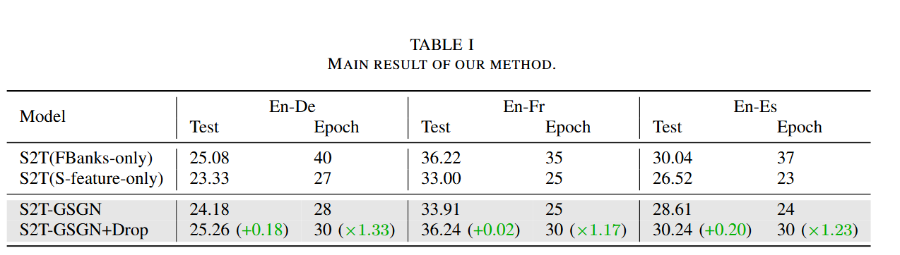

# GSGN
Code for paper "Optimizing Speech Multi-View Feature Fusion through Conditional Computation"

The paper has been accepted by ICASSP 2025.

We'll be releasing the code and more detailed soon.

## Result




## Citation

```bibtex
@misc{shan2025optimizingspeechmultiviewfeature,
      title={Optimizing Speech Multi-View Feature Fusion through Conditional Computation}, 
      author={Weiqiao Shan and Yuhao Zhang and Yuchen Han and Bei Li and Xiaofeng Zhao and Yuang Li and Min Zhang and Hao Yang and Tong Xiao and Jingbo Zhu},
      year={2025},
      eprint={2501.08057},
      archivePrefix={arXiv},
      primaryClass={eess.AS},
      url={https://arxiv.org/abs/2501.08057}, 
}