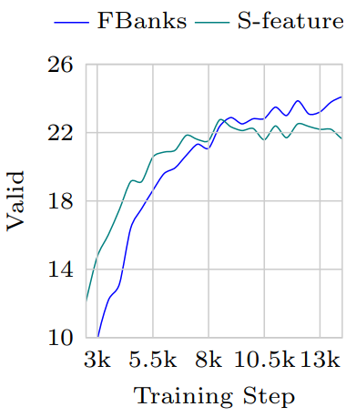

# GSGN
[*Optimizing Speech Multi-View Feature Fusion through Conditional Computation*](https://arxiv.org/abs/2501.08057) 代码仓

文章已经被 ICASSP 2025 接收.

**我们会很快开源代码.**

[英文](README.md) | [中文](README_ZH.md)

## 方法

**动机** 我们发现模型在使用FBanks和S-features特征时存在不同的趋势，一个收敛更快一个性能更好



**架构** 我们提出了一种新的通用特征融合方法，基于条件计算的特征融合框架


**结果**


## 训练

## 推断

## 引用

```bibtex
@misc{shan2025optimizingspeechmultiviewfeature,
      title={Optimizing Speech Multi-View Feature Fusion through Conditional Computation}, 
      author={Weiqiao Shan and Yuhao Zhang and Yuchen Han and Bei Li and Xiaofeng Zhao and Yuang Li and Min Zhang and Hao Yang and Tong Xiao and Jingbo Zhu},
      year={2025},
      eprint={2501.08057},
      archivePrefix={arXiv},
      primaryClass={eess.AS},
      url={https://arxiv.org/abs/2501.08057}, 
}